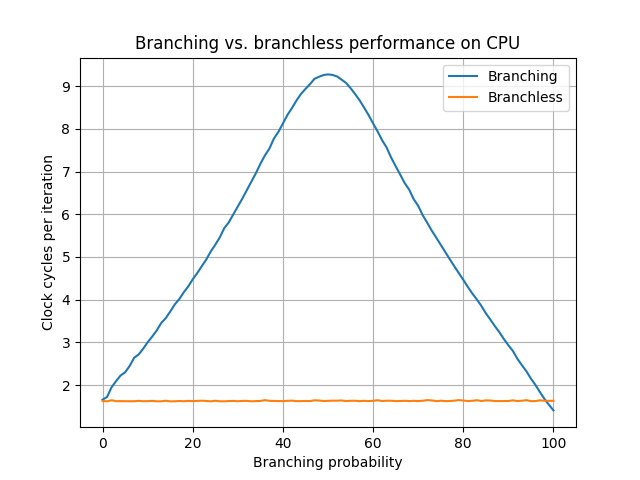

# cpu-performance-tests

This repository contains the code to benchmark CPU cache miss latency and branch misprediction penalty.

### Branch penalty

The pseudocode for the benchmark is as follows:
```cpp
// Generate a random array with a discrete distribution
int random[N] = {Uniform_distribution(0,100)}
volatile int sum = 0; // volatile is used to prevent vectorization and other optimisations
//count the clock cycles using rdtsc 
const auto start = __rdtsc();
for(i to N){
    if (random[i] < P){
        sum += random[i];
    }
}
// count the clock cycles
const auto stop = __rdtsc();
// compute the clock cycles per iteration
const auto cyclesPerIteration =  double(stop - start)/num_op;
```
The code executes a simple addition in a loop. The addition is executed only if the random value is smaller than P. This allow to tune the branching probability. 
The key `volatile` is used to prevent the compiler from optimizing and vectorizing the loop. The number of clock cycles is computed using `rdtsc`. Finally, the number of total clock cycles is divided by the number of iterations to compute the cycles per iteration. Clock cycles are used as a metric instead of time as for such small times fluctuation in clock frequency due to energy saving and boost behaviors might influence the results dramatically.


The results show a somewhat expected behavior: when the probability is not exactly 1/2, the branch predictor can guess the most likely outcome, thus reducing the cycles per iteration. When the probability is exactly either 0 or 1, there is no stochastic behavior, and the loop executes in two or three clock cycles. 

Branchless programming can be applied in this case to avoid the branching entirely. The result of comparison is usually intrepreted as a 0 or 1 that means that in this case it is possible to multiply `random[i]` with the result of the comparison `random[i] < P`. The resulting code looks as follows:
```cpp
// Generate a random array with a discrete distribution
int random[N] = {Uniform_distribution(0,100)}
volatile int sum = 0; // volatile is used to prevent vectorization and other optimisations
//count the clock cycles using rdtsc 
const auto start = __rdtsc();
for(i to N){
    sum += random[i] * (random[i] < P);
}
// count the clock cycles
const auto stop = __rdtsc();
// compute the clock cycles per iteration
const auto cyclesPerIteration =  double(stop - start)/num_op;
```



The results show that the branchless execution is faster then the branching solution in almost all cases. Towards 100% branching probability the previous solution has a slight advantage

### Memory latency

The pseudocode for the benchmark is as follows:
```cpp
auto vector = [i, padding for i in N]
vector.shuffle();
auto index = 0UL;
for (auto i = 0; i < num_ops; ++i) {
    // access the next node
    index = list[index].index;
}
```
The code begins by creating an array where array[i] = i with padding and then shuffling it using MersenneTwister. 

Then the array is accessed in a for loop using the index of the list. This causes stochastic uniform random accesses that the prefetcher fails to predict. This is a variation of the linked list approach found [here](https://medium.com/applied/applied-c-memory-latency-d05a42fe354e) who uses a linked list. The linked list method did not work on my machine and provided unreliable results. Moreover, is much slower. 


The results show:

1. L1 latency = 1ns
2. L2 latency = 10ns
3. L3 latency = 25-30ns
4. DRAM latency = 100-200ns

The DRAM latency varies between 100 and 200 because the tests are executed on a NUMA node.
